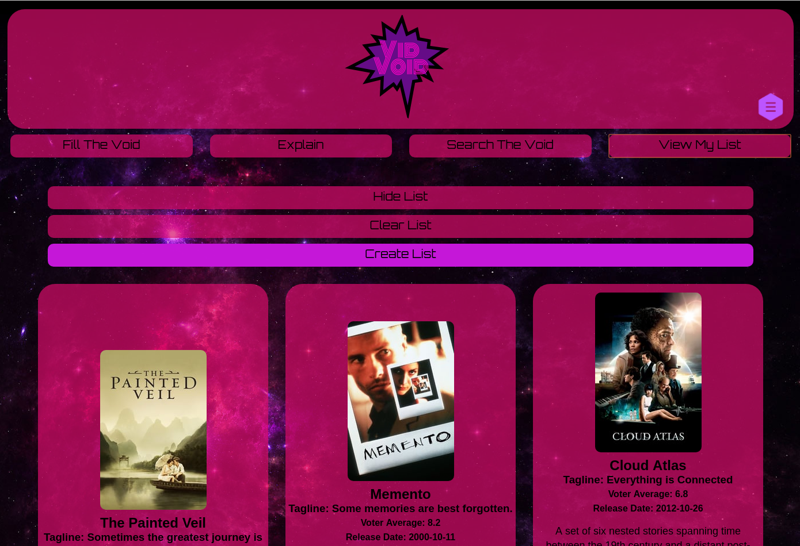

VidVoid is a cosmos-themed media suggestion app that gives a nealry endless list of suggested movies or TV shows. The app allows storage of selected media and allows the user to send custom playlists to themselves or others.

# Approach

This is a mobile-first, progressive enhancment project that focuses on delivering a responsive and intiuitive design.

# Tech

- HTML
- CSS
- JavaScript
- jQuery

# APIs

1. [The Movie DataBase API](https://developers.themoviedb.org/3/getting-started/introduction)
   - Utilized the "Trending", "People", Movies, "TV", and "Search" endpoints depending on user input to populate content
2. [emailJS API](https://www.emailjs.com/)
   - Utilized their API to turn string content into rendered HTML in e-mail format for delivery of formatted playlists.

# Features

- Provide Movie/TV suggestions to user
- Add any Movie/TV/Actor/Actress to a personal list
- User can mail list with custom title and message to themselves or anyone
- Search for any title or keyword for Movies, TV shows, or Actors and Actreses, all of which can be added to the user's list

# Demo

- [VidVoid Live](https://cosmic-noir.github.io/vidVoid/)

## ScreenShots

###### Mobile Home Screen

###### Suggestion with "Menu" hidden

###### Mobile personal list screen, showing "Create List" feature

###### Using Search feature for movies about space, Screen width > 750px

###### Viewing personal list with usable features

